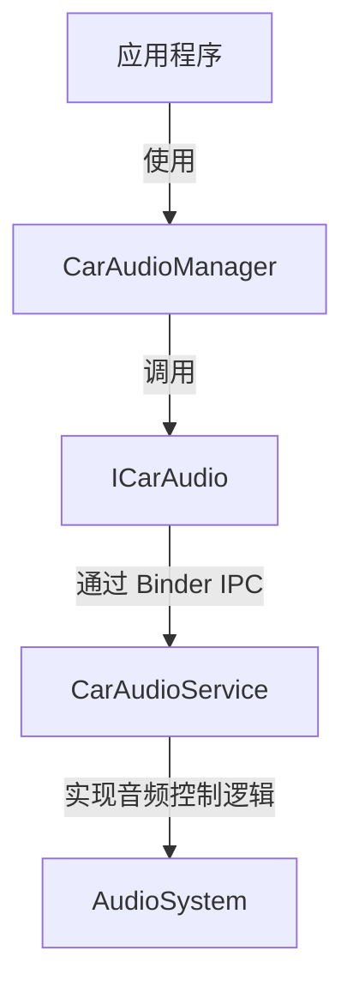

## 概述

在 Android Automotive 系统中，音频管理是一个重要的功能。`CarAudioManager` 是一个新的音频管理模块，专门用于控制车载音频系统。它允许应用程序控制音频流的路由、音量设置以及不同区域的音频管理。

`CarAudioManager` 模块由以下几个部分组成：

- **`ICarAudio`**：通过 AIDL 定义的进程间通信（IPC）接口，描述了 `CarAudioManager` 提供的所有功能。
- **`CarAudioService`**：在系统服务层实现的音频管理服务，实现了 `ICarAudio` 接口的具体功能。
- **`CarAudioManager`**：应用程序层使用的管理类，封装了 `ICarAudio` 的接口，提供给开发者用于控制车载音频系统。

## 模块架构

`CarAudioManager` 模块的架构设计基于 Android 的典型服务架构。其工作原理是通过 AIDL（Android Interface Definition Language）定义的接口来实现应用程序与系统服务之间的通信。

- **应用程序层**：开发者使用 `CarAudioManager` 类与车载音频服务交互。
- **系统服务层**：`CarAudioService` 实现了实际的音频控制逻辑。
- **Binder IPC**：通过 AIDL 机制，`CarAudioManager` 和 `CarAudioService` 之间通过 Binder IPC 通信。



## `ICarAudio`

### 1. 什么是 `ICarAudio`？

`ICarAudio` 是通过 AIDL 定义的接口，它定义了 `CarAudioManager` 的所有功能接口。AIDL（Android Interface Definition Language）用于定义 Android 系统中不同进程间的接口，使得应用程序可以调用系统服务中的方法。

### 2. `ICarAudio` 的定义

在 `packages/services/Car/car-lib/src/android/car/media/` 目录下。这个文件定义了 `CarAudioManager` 所需的功能接口，如音量设置和获取。

```aidl
package android.car.media;

/**
 * ICarAudio AIDL interface for managing car audio controls.
 */
interface ICarAudio {
    /**
     * Sets the volume for a specific audio usage.
     *
     * @param usage The audio usage defined by AudioAttributes.
     * @param volume The volume level to set.
     */
    void setVolumeForUsage(int usage, int volume);

    /**
     * Retrieves the current volume for a specific audio usage.
     *
     * @param usage The audio usage defined by AudioAttributes.
     * @return The current volume level.
     */
    int getVolumeForUsage(int usage);
}
```

### 3. `ICarAudio` 的作用

`ICarAudio` 接口提供了一组方法，用于控制车载音频的不同功能。它作为应用程序层（通过 `CarAudioManager`）与系统服务层（`CarAudioService`）之间的桥梁，负责接收应用程序的请求，并将其传递给 `CarAudioService` 实现。

## `CarAudioService`

### 1. 什么是 `CarAudioService`？

`CarAudioService` 是 Android 系统服务层的一个音频管理服务，实现了 `ICarAudio` 接口的所有方法。它的职责是处理来自 `CarAudioManager` 的音频控制请求，并与底层音频系统（如 `AudioSystem`）进行交互。

### 2. `CarAudioService` 的实现

在 `packages/services/Car/service/src/com/android/car/audio/` 目录下，实现了 `ICarAudio` 接口。

```java
package com.android.server.media;

import android.media.ICarAudio;
import android.os.RemoteException;
import android.util.Log;

/**
 * Service that provides car audio management capabilities.
 */
public class CarAudioService extends ICarAudio.Stub implements CarServiceBase {

    static final String TAG = CarLog.TAG_AUDIO;

    @Override
    public void setVolumeForUsage(int usage, int volume) {
        Log.d(TAG, "Setting volume for usage: " + usage + " to " + volume);
        // TODO: Implement actual volume setting logic for the car environment.
    }

    @Override
    public int getVolumeForUsage(int usage) {
        Log.d(TAG, "Getting volume for usage: " + usage);
        // TODO: Implement actual logic to retrieve current volume.
        return 0; // Return default volume level.
    }
}
```

### 3. 服务注册

`CarAudioService` 在 `ICarImpl` 中创建，然后在 `CarServiceImpl` 中注册 `car_service` 服务，使其成为一个系统服务，可以被其他应用程序通过 `Binder` 调用。

```java
package com.android.car;

/** Implementation of CarService */
public class CarServiceImpl extends ProxiedService {
    public static final String CAR_SERVICE_INIT_TIMING_TAG = "CAR.InitTiming";

    private ICarImpl mICarImpl;

    @Override
    public void onCreate() {
        ...

        mICarImpl = new ICarImpl(this,
                getBuiltinPackageContext(),
                mVehicle,
                SystemInterface.Builder.defaultSystemInterface(this).build(),
                mVehicleInterfaceName);
        mICarImpl.init();

        ServiceManagerHelper.addService("car_service", mICarImpl);
        SystemPropertiesHelper.set("boot.car_service_created", "1");

        ...
    }
    ...
}
```

```java
package com.android.car;

import android.car.Car;
import android.car.CarFeatures;
import android.car.ICar;
import android.car.ICarResultReceiver;

public class ICarImpl extends ICar.Stub {

    private final CarAudioService mCarAudioService;

    private final CarServiceBase[] mAllServices;

    public ICarImpl(Context serviceContext, Context builtinContext, VehicleStub vehicle,
            SystemInterface systemInterface, String vehicleInterfaceName) {
        this(serviceContext, builtinContext, vehicle, systemInterface, vehicleInterfaceName,
                /* carUserService= */ null, /* carWatchdogService= */ null,
                /* carPerformanceService= */ null, /* garageModeService= */ null,
                /* powerPolicyDaemon= */ null, /*carTelemetryService= */ null);
    }

    @VisibleForTesting
    ICarImpl(Context serviceContext, @Nullable Context builtinContext, VehicleStub vehicle,
            SystemInterface systemInterface, String vehicleInterfaceName,
            @Nullable CarUserService carUserService,
            @Nullable CarWatchdogService carWatchdogService,
            @Nullable CarPerformanceService carPerformanceService,
            @Nullable GarageModeService garageModeService,
            @Nullable ICarPowerPolicySystemNotification powerPolicyDaemon,
            @Nullable CarTelemetryService carTelemetryService) {
        ...
        mCarAudioService = constructWithTrace(t, CarAudioService.class,
                () -> new CarAudioService(serviceContext));
        ...
        List<CarServiceBase> allServices = new ArrayList<>();
        ...
        allServices.add(mCarAudioService);
        ...
        mAllServices = allServices.toArray(new CarServiceBase[allServices.size()]);
    }

    @MainThread
    void init() {
        mHal.init();

        for (CarServiceBase service : mAllServices) {
            service.init();
        }

        if (ENABLE_OEM_SERVICE) {
            mCarOemService.onInitComplete();
        }
    }
}
```

### 4. `CarAudioService` 的作用

`CarAudioService` 作为系统服务层，直接与 Android 音频系统交互，负责处理来自 `CarAudioManager` 的音频请求。它通过实现 `ICarAudio` 接口的方法，提供对车载音频系统的控制功能。

## `CarAudioManager`

### 1. 什么是 `CarAudioManager`？

`CarAudioManager` 是应用程序层的一个管理类，封装了与 `ICarAudio` 的交互接口。它为开发者提供了简单易用的 API，用于控制车载音频功能，如设置音量、获取音量等。

### 2. `CarAudioManager` 的实现

在 `packages/services/Car/car-lib/src/android/car/media/` 目录下，用于与 `CarAudioService` 交互。

```java
package android.car.media;

import android.os.RemoteException;
import android.util.Log;

/**
 * CarAudioManager implementation for controlling car audio.
 */
public class CarAudioManager extends CarManagerBase {
    private final ICarAudio mService;
    private final AudioManager mAudioManager;

    /** @hide */
    public CarAudioManager(Car car, IBinder service) {
        super(car);
        mService = ICarAudio.Stub.asInterface(service);
        mAudioManager = getContext().getSystemService(AudioManager.class);
        mCarVolumeCallbacks = new CopyOnWriteArrayList<>();
        mEventHandler = new EventHandler(getEventHandler().getLooper());
    }

    /**
     * Sets the volume for a specific audio usage.
     */
    public void setVolumeForUsage(int usage, int volume) {
        try {
            mService.setVolumeForUsage(usage, volume);
        } catch (RemoteException e) {
            handleRemoteExceptionFromCarService(e);
        }
    }

    /**
     * Gets the volume for a specific audio usage.
     */
    public int getVolumeForUsage(int usage) {
        try {
            return mService.getVolumeForUsage(usage);
        } catch (RemoteException e) {
            return handleRemoteExceptionFromCarService(e, 0);
        }
    }
}
```

### 3. `CarAudioManager` 的作用

`CarAudioManager` 是应用程序和 `CarAudioService` 之间的桥梁。开发者可以通过 `CarAudioManager` 提供的方法来控制车载音频系统，而不需要直接与 `ICarAudio` 或 `CarAudioService` 进行交互。它提供了一种更高层次、更易于使用的接口，使得应用程序能够方便地管理车载音频。


## 示例

如现在要添加一个接口，用于设置音频左右平衡。

```java
    void setBalance(int value);
    int getBalance();
```

### ICarAudio 修改点

```diff
diff --git a/car-lib/src/android/car/media/ICarAudio.aidl b/car-lib/src/android/car/media/ICarAudio.aidl
index 93f35e0..901f5d4 100644
--- a/car-lib/src/android/car/media/ICarAudio.aidl
+++ b/car-lib/src/android/car/media/ICarAudio.aidl
@@ -62,6 +62,10 @@ interface ICarAudio {
     List<AudioDeviceAttributes> getInputDevicesForZoneId(int zoneId);

     boolean isPlaybackOnVolumeGroupActive(int volumeGroupId, int audioZoneId);
+
+    void setBalance(int fieldX);
+    int getBalance();
+
     /**
      * IBinder is ICarVolumeCallback but passed as IBinder due to aidl hidden.
      */
```

### CarAudioService 修改点

```diff
diff --git a/service/src/com/android/car/audio/CarAudioService.java b/service/src/com/android/car/audio/CarAudioService.java
index 8f0a393..73af6e4 100644
--- a/service/src/com/android/car/audio/CarAudioService.java
+++ b/service/src/com/android/car/audio/CarAudioService.java
@@ -765,6 +765,23 @@ public class CarAudioService extends ICarAudio.Stub implements CarServiceBase {
     }

     @Override
+    public void setBalance(int fieldX) {
+        synchronized (mImplLock) {
+            enforcePermission(Car.PERMISSION_CAR_CONTROL_AUDIO_VOLUME);
+            //getAudioControlWrapperLocked().setBalanceTowardRight(value);
+        }
+    }
+
+    @Override
+    public int getBalance() {
+        synchronized (mImplLock) {
+            enforcePermission(Car.PERMISSION_CAR_CONTROL_AUDIO_VOLUME);
+            //getAudioControlWrapperLocked().setBalanceTowardRight(value);
+            return 0;
+        }
+    }
+
+    @Override
     public void setFadeTowardFront(float value) {
         synchronized (mImplLock) {
             enforcePermission(Car.PERMISSION_CAR_CONTROL_AUDIO_VOLUME);
```

### CarAudioManager 修改点

```diff
diff --git a/car-lib/src/android/car/media/CarAudioManager.java b/car-lib/src/android/car/media/CarAudioManager.java
index 47a737f..4cba049 100644
--- a/car-lib/src/android/car/media/CarAudioManager.java
+++ b/car-lib/src/android/car/media/CarAudioManager.java
@@ -334,6 +334,26 @@ public final class CarAudioManager extends CarManagerBase {
         }
     }

+    @SystemApi
+    @RequiresPermission(Car.PERMISSION_CAR_CONTROL_AUDIO_VOLUME)
+    void setBalance(int fieldX) {
+        try {
+            mService.setBalance(fieldX);
+        } catch (RemoteException e) {
+            handleRemoteExceptionFromCarService(e);
+        }
+    }
+
+    @SystemApi
+    @RequiresPermission(Car.PERMISSION_CAR_CONTROL_AUDIO_VOLUME)
+    int getBalance() {
+        try {
+            return mService.getBalance();
+        } catch (RemoteException e) {
+            return handleRemoteExceptionFromCarService(e, 0);
+        }
+    }
+
     /**
      * Adjust the relative volume in the front vs back of the vehicle cabin.
      *
```
