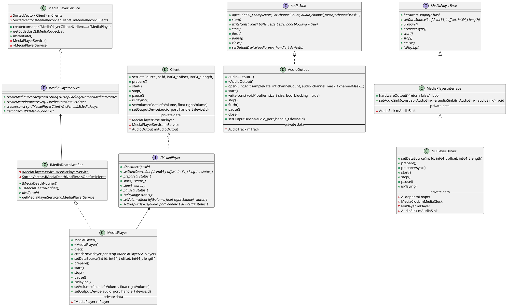
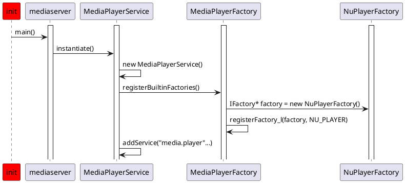
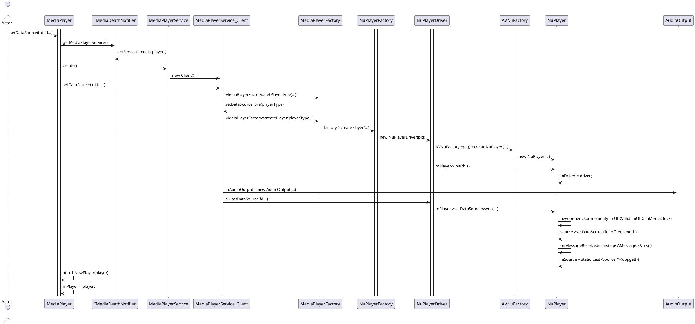
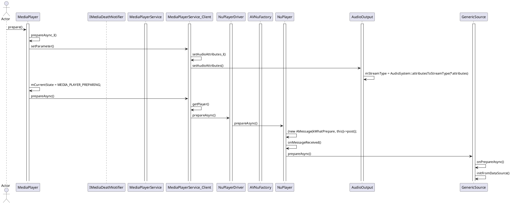

## JAVA层

```java
public static MediaPlayer create(Context context, int resid, 
        AudioAttributes audioAttributes, int audioSessionId) {
    
    // 通过资源管理器打开原始资源文件描述符
    AssetFileDescriptor afd = context.getResources().openRawResourceFd(resid);
    if (afd == null) {
        // 资源打开失败时返回null（通常表示resid无效）
        return null;
    }

    // 创建新MediaPlayer实例
    MediaPlayer mp = new MediaPlayer();

    // 配置音频属性：使用传入参数或创建默认配置
    final AudioAttributes aa = (audioAttributes != null) 
            ? audioAttributes : new AudioAttributes.Builder().build();
    
    // 设置音频属性（替代旧setAudioStreamType方法）
    mp.setAudioAttributes(aa);
    
    // 配置音频会话ID（0=自动生成，非0=加入现有会话）
    mp.setAudioSessionId(audioSessionId);

    // 设置数据源（需传入文件描述符、起始偏移量和长度）
    // 注：此处使用原始资源的文件描述符，支持非压缩资源文件
    mp.setDataSource(afd.getFileDescriptor(), afd.getStartOffset(), afd.getLength());

    // 同步准备播放器（阻塞当前线程直到准备完成）
    mp.prepare(); // 可能抛出IllegalStateException或IOException
    
    return mp;
}
```


## 相关源码路径

**frameworks/base/media/java/android/media/MediaPlayer.java** 

**frameworks/base/media/jni/android_media_MediaPlayer.cpp** 

**frameworks/av/media/libmedia/mediaplayer.cpp** 

**frameworks/av/media/mediaserver/main_mediaserver.cpp** 

**frameworks/av/media/libmediaplayerservice/MediaPlayerService.cpp** 


## MediaPlayer类图



## MediaPlayerService初始化流程



## setDataSource流程



## prepare流程

