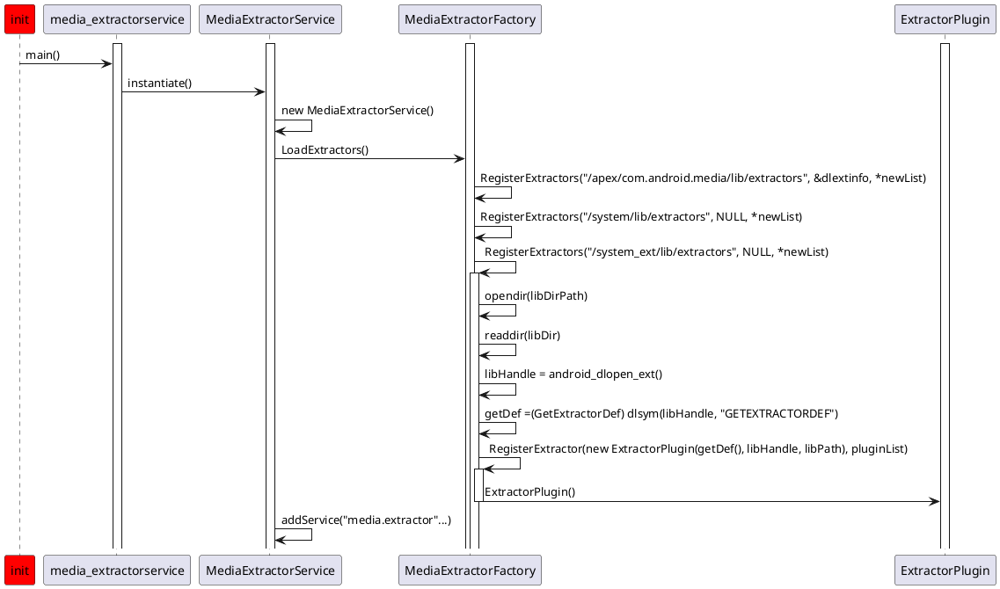
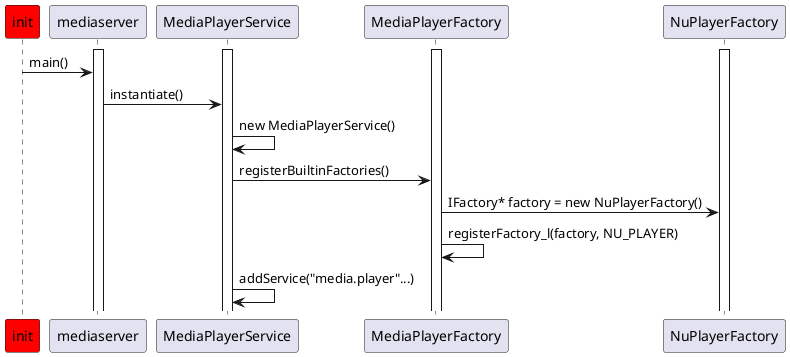
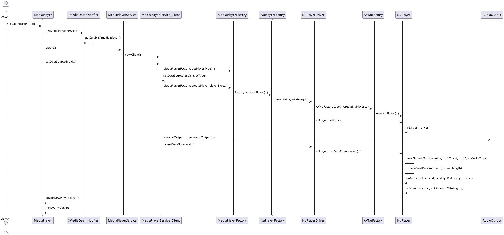
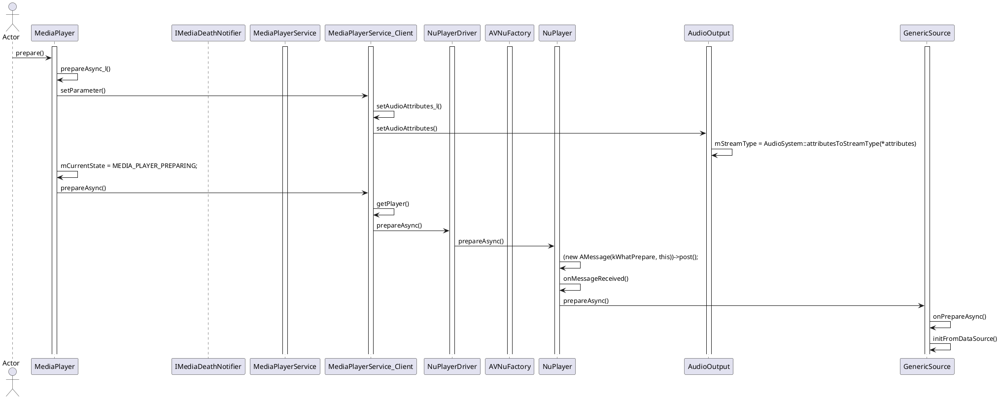

# Android音频之MediaExtractor浅析

## 概述
`MediaExtractor`是Android多媒体框架中用于解封装音视频数据的关键类，支持从本地文件或网络流中分离音频、视频等轨道数据。它常与`MediaCodec`和`MediaMuxer`配合使用，实现音视频的提取、解码和合成操作。本文将从核心功能、使用流程及实践场景等方面展开分析。

---

## 核心功能

### 1. **轨道管理**
- **多轨道支持**：通过`getTrackCount()`获取媒体文件中的轨道数量（如音频、视频、字幕）。
- **轨道格式解析**：利用`getTrackFormat(int index)`获取轨道格式信息（如MIME类型、采样率、声道数等）。

### 2. **数据提取**
- **读取原始数据**：通过`readSampleData(ByteBuffer, offset)`从选定轨道中读取编码后的音频/视频数据块。
- **时间戳同步**：`getSampleTime()`获取当前数据块的时间戳，用于音视频同步。

### 3. **格式适配**
- 支持常见容器格式（如MP4、MKV），但网络流协议（如HLS、RTSP）支持有限。

---

## 使用流程

### 1. **初始化与数据源设置**
```java
MediaExtractor extractor = new MediaExtractor();
extractor.setDataSource(filePath);  // 支持文件路径或Uri
```

### 2. **轨道选择**
遍历轨道并筛选目标音频轨道：
```java
for (int i = 0; i < extractor.getTrackCount(); i++) {
    MediaFormat format = extractor.getTrackFormat(i);
    if (format.getString(MediaFormat.KEY_MIME).startsWith("audio/")) {
        extractor.selectTrack(i);
        break;
    }
}
```
**关键参数**：`MediaFormat.KEY_MIME`判断MIME类型（如`audio/mp4a-latm`）。

### 3. **数据读取循环**
```java
ByteBuffer buffer = ByteBuffer.allocate(128 * 1024);
while (true) {
    int sampleSize = extractor.readSampleData(buffer, 0);
    if (sampleSize <= 0) break;
    long pts = extractor.getSampleTime();
    extractor.advance();  // 移动至下一数据块
}
```
**注意点**：`advance()`必须调用以推进读取指针。

### 4. **资源释放**
```java
extractor.release();  // 避免内存泄漏
```

---

## 高级技巧与注意事项

### 1. **自定义数据源扩展**
Android未开放`DataSource`接口，但可通过反射或自定义类实现网络流支持（需适配`readAt()`和`getSize()`方法）。

### 2. **异常处理**
- **网络流限制**：默认仅支持HTTP协议，需自行处理实时流（如RTSP）的分段下载与解析。
- **内存管理**：大数据读取时需动态调整`ByteBuffer`容量，防止OOM。

### 3. **与MediaCodec协作**
将提取的音频数据送入解码器：
```java
MediaCodec codec = MediaCodec.createDecoderByType(mimeType);
codec.configure(format, null, null, 0);
codec.start();
// 将extractor读取的数据输入解码器
```

---

## 应用场景

### 1. **音频提取与转码**
从视频文件中分离音频轨道，并通过`MediaMuxer`重新封装为MP3/AAC文件。

### 2. **流媒体处理**
结合自定义`DataSource`实现渐进式下载与播放（如边下边播）。

### 3. **音视频同步**
通过提取的时间戳（`getSampleTime()`）实现播放器中的音画同步。

---

## 相关源码路径

**frameworks/base/media/java/android/media/MediaExtractor.java**

**frameworks/base/media/jni/android_media_MediaExtractor.cpp**

**frameworks/av/media/libstagefright/NuMediaExtractor.cpp**

**frameworks/av/services/mediaextractor/main_extractorservice.cpp** 


## media.extractor服务

### 初始化流程




## MediaExtractor

### 使用流程


## MediaPlayerService初始化流程



## setDataSource流程



## prepare流程

